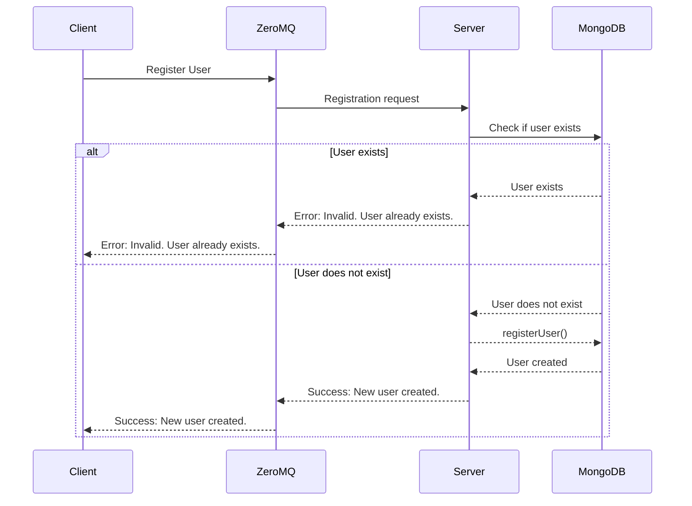
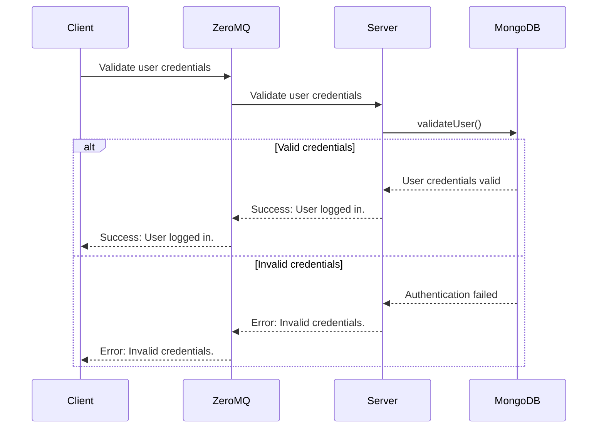

# Communication Contract
----------------------------------------------------------------------------------------------------------------------------------------------------------------------------------------------------------------------------------------------------
## Requesting Data:
As requested, the microservice used zeroMQ for pipe communication purposes. The microservice is currently bound to "tcp://127.0.0.1:5555". (Of course, this can be changed if desired.) In order to make a user validation request to the microservice, you'll need to connect to the correct socket address. You'll then need to send the user data to the microservice in the following format:
{
  login: {
    username: "exampleUsername",
    password: "examplePassword",
    isNewUser: true/false
  }
};

The following is an example call:

const microserviceAddress = 'tcp://127.0.0.1:5555';
sock.connect(microserviceAddress);

const testMessage = {
    login: {
        username: "testUser1234",
        password: "testPassword123",
        isNewUser: true
    }
};

await sock.send(JSON.stringify(testMessage));

----------------------------------------------------------------------------------------------------------------------------------------------------------------------------------------------------------------------------------------------------

## Receiving Data:
To receive data from the microservice, you'll need to have connected to the socket and have sent a request as shown previously. Note that both the await sock.send and the following code should be encapsulated in a try block with a catch that displays the error. Don't forget to close the socket connection. This should be done in a "finally" block after the catch so it is executed whether or not an exception occurred.

const [response] = await sock.receive();
const parsedResponse = JSON.parse(response.toString());
console.log("Received response from microservice:", parsedResponse);

sock.close();

NOTE:
Make sure you install the necessary dependencies to run the microservice:
bcrypt
mongodb
node
zeromq

----------------------------------------------------------------------------------------------------------------------------------------------------------------------------------------------------------------------------------------------------

## Sequence Diagrams:
I've included a sequence diagram for both validating an existing user and registering a new one:

### Registering a User:

### Validating an Existing User:

